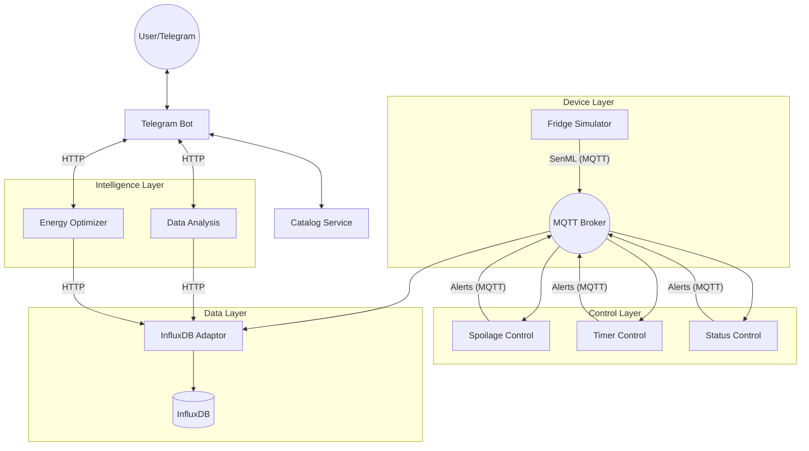

# SmartChill - IoT Fridge Monitoring Platform 🧊

**Version:** 1.0.0
**Team:** Alexander Duchaine (346096), Luca Marchese (261683)
**Course:** Programming for IoT (Politecnico di Torino)

# ❄️ SmartChill - Intelligent IoT Fridge Management System

**SmartChill** is a comprehensive IoT ecosystem designed to monitor, control, and optimize smart refrigerators. Built on a microservices architecture, it leverages MQTT for real-time communication, InfluxDB for time-series data storage, and Machine Learning for energy optimization.

The system provides real-time alerts via Telegram, monitors food spoilage, ensures door security, and predicts energy consumption patterns.

---

## 🏗️ System Architecture

The project follows a **Service-Oriented Architecture (SOA)**. The components interact via two main communication protocols:

1. **MQTT (Pub/Sub):** Used for real-time telemetry (sensors), events (door opening), and alerts.  
2. **REST API (HTTP):** Used for service discovery (Catalog), configuration, and retrieving historical data.

---

### High-Level Data Flow



---

## 🧩 Microservices Overview

| Service | Description | Protocol |
|--------|-------------|----------|
| **Catalog Service** | Central registry of devices, users, and services. | HTTP |
| **Fridge Simulator** | Generates realistic temperature, humidity, and gas sensor data. | MQTT |
| **InfluxDB Adaptor** | Stores data in InfluxDB and exposes retrieval APIs. | MQTT / HTTP |
| **Telegram Bot** | User interface for monitoring and alerts. | HTTP / MQTT |
| **Spoilage Control** | Detects VOC spikes and food spoilage. | MQTT |
| **Timer Control** | Detects door left open events. | MQTT |
| **Status Control** | Detects temperature/humidity anomalies. | MQTT |
| **Data Analysis** | Historical trend analysis. | HTTP |
| **Energy Optimizer** | Predicts energy usage via Machine Learning. | HTTP |

---

## 📡 Communication & Data Format

### **1. Data Format (SenML)**

All sensor data sent over MQTT follows the **SenML JSON standard**.

**Example:**

```json
{
  "bn": "SmartChill_A1B2C3/",
  "bt": 1678886400,
  "e": [
    { "n": "temperature", "u": "Cel", "v": 4.5 },
    { "n": "humidity", "u": "%RH", "v": 60 }
  ]
}
```

---

### **2. MQTT Topic Structure**

**Sensors:**  
`Group17/SmartChill/Devices/{model}/{device_id}/{sensor_type}`

**Events:**  
`Group17/SmartChill/Devices/{model}/{device_id}/door_event`

**Alerts:**  
`Group17/SmartChill/{device_id}/Alerts/{alert_type}`

**Config:**  
`Group17/SmartChill/{service_name}/{device_id}/config_update`

---

## 🚀 How to Run

### **Prerequisites**

- Python 3.9+
- Mosquitto MQTT Broker (port 1883)
- InfluxDB v2 (port 8086)

### **Installation**

Clone the repository:

```bash
git clone https://github.com/AlexDuchaine19/SmartChill.git
cd SmartChill
```

Install dependencies:

```bash
pip install cherrypy requests paho-mqtt telepot influxdb-client scikit-learn numpy
```

---

### **Execution Order**

Start services in this order:

1. **Infrastructure:** Mosquitto, InfluxDB  
2. **Catalog:**  
   ```bash
   python Catalog/main.py
   ```  
3. **Adaptor:**  
   ```bash
   python InfluxDB_Adaptor/main.py
   ```  
4. **Control Services:**  
   Spoilage, Timer, Status → run each `main.py`  
5. **Analytics:**  
   Data Analysis + Energy Optimization  
6. **Telegram Bot:**  
   ```bash
   python TelegramBot/main.py
   ```  
7. **Device Simulator:**  
   ```bash
   python Fridge_Device/main.py
   ```

---

## 👤 User Guide (Telegram Bot)

Once the system is running:

### Basic Commands
- **/start** — Begin interaction  
- **/mydevices** — List registered fridges  

### Management
Modify thresholds (temperature limits, door timeout) directly via Telegram inline menus.

### Alerts Received Automatically
- 🚪 Door left open  
- 🔥 Food spoilage detected  
- 🌡 Temperature anomalies  

---

## 🛠 Configuration

Each service contains a `settings.json`.

Important files:

- `Catalog/catalog.json` — System state  
- `TelegramBot/settings.json` — Bot Token  
- `InfluxDB_Adaptor/settings.json` — InfluxDB Token, Org, Bucket  

---

## 👥 Authors

**Group 17 - IoT Project**
